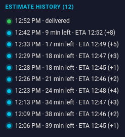

# Wolt Time

Shows original vs live delivery estimate + drift in Wolt's "Being delivered" view.

Also, in the order receipt, shows who owes what for "Order Together" group orders — each person's own items plus an even split of delivery and fees — with a "Copy for Splitwise" button.

## Install locally

1. `git clone git@github.com:kaareloun/wolt-time.git`
2. Open `chrome://extensions` → enable Developer mode → Load unpacked → select this folder.
